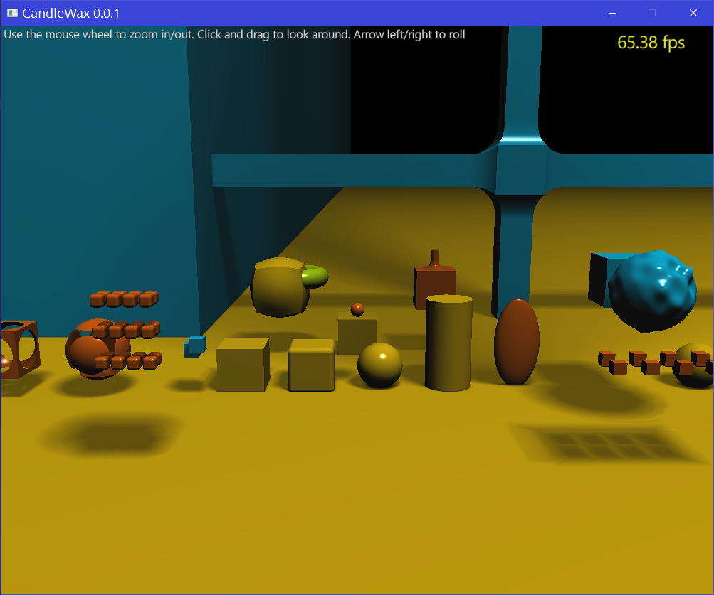
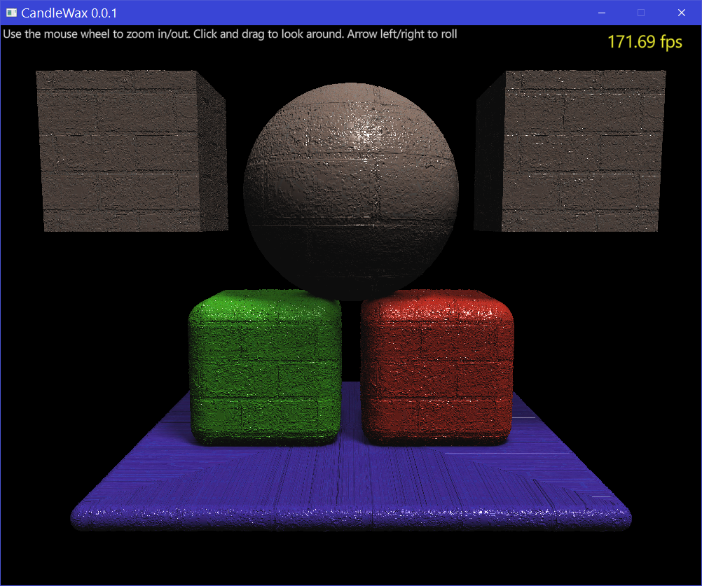

# CandleWax

Signed Distance Field Renderer

#### Requirements
- Java runtime
- Kotlin (for compilation)
- Vulkan runtime
- VulkanLib [https://github.com/pvmoore/vulkanlib]
- LWJGL 3 [https://www.lwjgl.org/]
- JOML [https://github.com/JOML-CI/JOML]
- Log4J [http://logging.apache.org/log4j/1.2]
